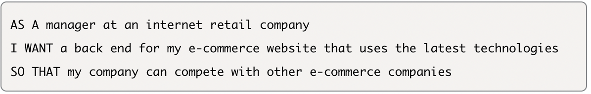
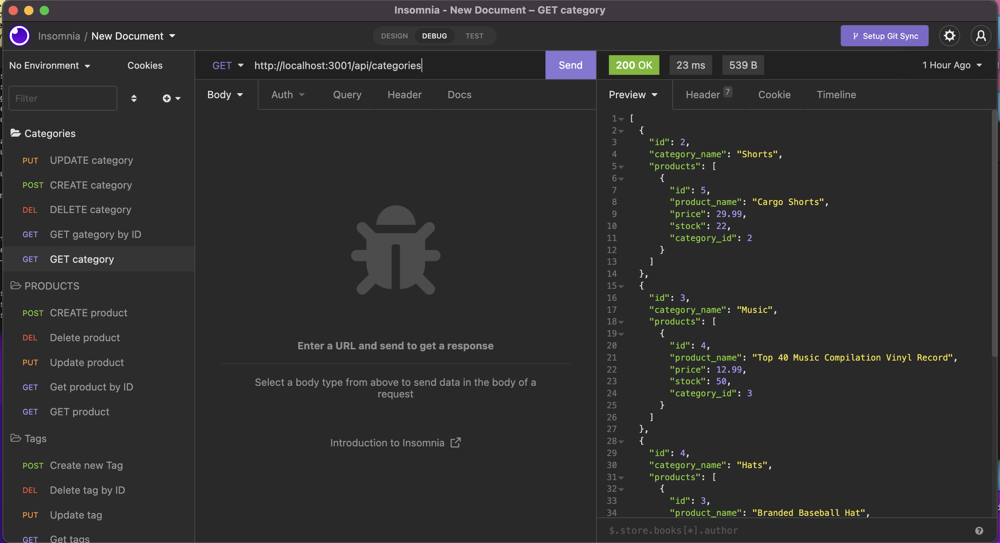
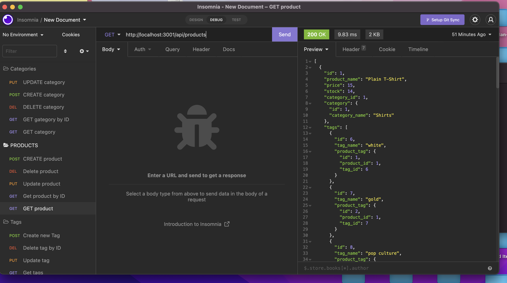

# e-commerce_chopshop

## Description
Internet retail, also known as e-commerce, is the largest sector of the electronics industry, having generated an estimated US$29 trillion in 2017 (Source: United Nations Conference on Trade and Development). E-commerce platforms like Shopify and WooCommerce provide a suite of services to businesses of all sizes. Due to the prevalence of these platforms, developers should understand the fundamental architecture of e-commerce sites

## User Story 

## Walk through video
https://drive.google.com/file/d/1_BGar74Mwh_9NkLRxbYyoqLFFQBOuz3K/view

## Screenshots 

## Usage 
This application allows users to manage an inventory of products, categories, and tags. API routes will allow a user to fetch and update data through their front end, and display it on their webpage 
